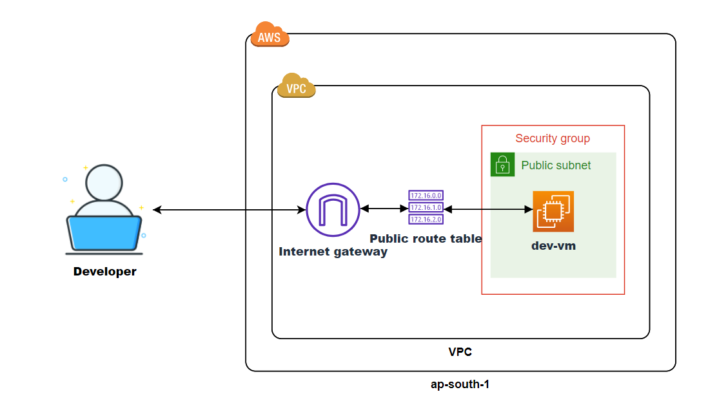

# Terraform AWS Infrastructure

This Terraform configuration file sets up a basic AWS infrastructure with a VPC, subnet, internet gateway, route table, security group, and an EC2 instance.

## Architecture Diagram



## Prerequisites

- Terraform installed
- AWS account and AWS CLI configured
- An SSH key pair available on your local machine

## Setup

1. **Install Terraform**:
    Ensure Terraform is installed on your local machine. You can download it from the official [Terraform website](https://www.terraform.io/downloads.html).

2. **AWS CLI Configuration**:
    Configure your AWS CLI with the necessary credentials. Run:
    ```sh
    aws configure
    ```
    Ensure you have the `default` profile set up with access to the `ap-south-1` region.

3. **Prepare SSH Key Pair**:
    Ensure you have an SSH key pair available in `~/.ssh/mainkey.pub`. If not, create one using:
    ```sh
    ssh-keygen -t rsa -b 2048 -f ~/.ssh/mainkey
    ```

## Configuration

The configuration file consists of the following resources:

1. **VPC**:
    - CIDR Block: `10.0.0.0/16`
    - DNS Hostnames: Enabled
    - Name Tag: `dev`

2. **Subnet**:
    - VPC ID: Reference to the VPC created
    - CIDR Block: `10.0.1.0/24`
    - Public IP on Launch: Enabled
    - Name Tag: `dev-public-subnet`

3. **Internet Gateway**:
    - VPC ID: Reference to the VPC created
    - Name Tag: `dev-igw`

4. **Route Table**:
    - VPC ID: Reference to the VPC created
    - Name Tag: `dev-rt`

5. **Route**:
    - Route Table ID: Reference to the route table created
    - Destination CIDR Block: `0.0.0.0/0`
    - Gateway ID: Reference to the internet gateway created

6. **Route Table Association**:
    - Subnet ID: Reference to the subnet created
    - Route Table ID: Reference to the route table created

7. **Security Group**:
    - Name: `dev-sg`
    - Description: `Dev security group`
    - VPC ID: Reference to the VPC created
    - Ingress Rules: Allow all traffic (not recommended for production)
    - Egress Rules: Allow all traffic (not recommended for production)

8. **Key Pair**:
    - Key Name: `deployer-key`
    - Public Key: Reference to the public key file

9. **EC2 Instance**:
    - AMI: Latest Ubuntu 24.04 AMI
    - Instance Type: `t2.micro`
    - User Data: Custom script file (`customdata.tpl`)
    - Key Name: Reference to the key pair created
    - Security Group: Reference to the security group created
    - Subnet ID: Reference to the subnet created
    - Root Block Device: 10 GB volume
    - Name Tag: `dev-vm`

## Deployment

1. **Initialize Terraform**:
    ```sh
    terraform init
    ```

2. **Plan the Deployment**:
    ```sh
    terraform plan
    ```

3. **Apply the Configuration**:
    ```sh
    terraform apply
    ```
    Type `yes` when prompted to confirm the deployment.

## Cleanup

To destroy the infrastructure created by this configuration, run:
```sh
terraform destroy
```
Type yes when prompted to confirm the destruction.

---

## Author

**Irusha Malalgoda**

- GitHub: [your-github-username](https://github.com/irushahm)
- LinkedIn: [your-linkedin-profile](https://www.linkedin.com/in/ihasantha)

For any questions or feedback, feel free to reach out via the above platforms.